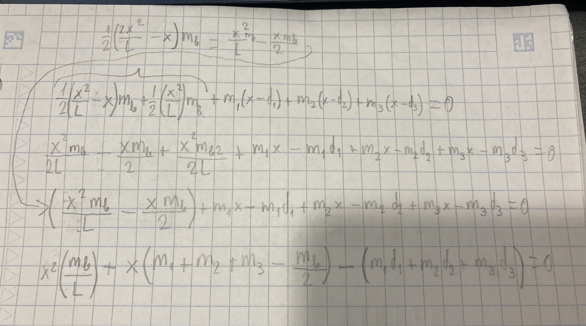

# TOADsim

Simple 2D physics simulation of a rocket powered hopper

## Introduction

I am an engineering student at Purdue University. Here, I joined Purdue Space Program's Active Controls team, where I am helping develop the propulsion system for TOAD, a 400-pound, 6-foot-tall lander that will take off, climb to 50m, and then make a soft landing under rocket power on a designated pad. As part of the design process for this complex propulsion system, we need to find a way of storing and delivering the propellants in a way that does not hurt the maneuverability and stability of the vehicle. The way we distribute the masses about the vehicle will affect the magnitude of the moment of inertia of the vehicle, thus reducing or increasing the effect of the torque applied by the engine when its thrust line is altered. To test the maneuverability of different mass distributions, I decided to create TOAD sim. TOAD sim simulates the entire vehicle with a simplified model made up of rods and point masses that together give a reasonably accurate approximation of what the real vehicle will behave like.

_Note: I wrote this program as a final individual project for ENGR 133 in the fall semester of 2023._

## Inputs and Outputs

### Inputs

The inputs in this program are divided into three categories. Vehicle characteristics, propellant amounts, and vehicle controls. The first category, vehicle characteristics, is the description of the different components that make the model. These inputs have to be changed manually in the code itself since there are far too many parameters that will normally remain constant between trial runs of the program. Instead, these are well-commented variables in a section near the top of the program file. The second category of inputs is the propellant masses. These parameters are the masses for both fuel and oxidizer as well as the pressurant that will force them into the engine. The inputs are taken with a terminal user interface that contains an error-checking algorithm that prevents the user from accidentally entering values that will result in an invalid solution. The last category of inputs is made up of the controls used to maneuver the vehicle. These are managed by the Pygame keyboard input system.

### Outputs

For the outputs, the program window displays a few important indicators. The first one is a triangle that represents the vehicle itself. The tip of the triangle is drawn pointing in the direction of the top of the vehicle. To the right of the vehicle indicator, there is a text segment that shows the current altitude. Across the top of the screen, several indicators display the propellant and throttle levels, with text elements on the left and propellant indication bars on the right.

## User Defined Functions

Several user-defined functions are used to simplify the structure of the program. From simplest to most complicated, there is the mass_inputs() function, the draw_TOAD() function, and the COM_Calc() function.

### mass_inputs()

The mass_inputs() function displays a message on the terminal to prompt the user for propellant/masses to use in the simulation, it then checks for errors (are the values negative?) and returns a list with the three, validated masses that can then be assigned to the respective variables to be used in the simulation.

### draw_TOAD()

The draw_TOAD() function draws the triangle that represents TOAD based on the input values of surface (Pygame window), color, height (of TOAD), x-coordinate, y-coordinate, and angle (at which TOAD is pointing). The function first calculates the coordinates of the points that make each corner of the triangle. It then uses a rotation matrix and the angle parameter to rotate the points about the center of the triangle and uses these new, updated points to draw the triangle using pygame.draw.polygon().

### COM_Calc()

The COM_Calc() function is in my opinion the most complex and interesting function. Its purpose is to find the offset of the center of mass from the origin based on the three dynamic point masses (propellant tanks) and the rod mass (frame). It takes the characteristics of these elements and uses an equation I derived by setting up a torque problem to find the center of mass. Here are some pictures of the process:

Initial setup of the problem

Simplification into a quadratic that can be solved with code

The function then returns the distance between the origin and the center of mass, which is referenced extensively throughout the calculations.

The function then returns the distance between the origin and the center of mass, which is referenced extensively throughout the calculations.

## User guide

The program first prompts the user to enter the mass values in kilograms for the different propellants in the terminal. The recommended (and closest to the actual vehicle) values are 20 for the fuel, 20 for the oxidizer, and 4 for the pressurant. Once the user enters the three values correctly, a Pygame window should pop up on the screen or the taskbar. Once in this window, the user can use the following keys for control:

| Key         | Action                         |
| ----------- | ------------------------------ |
| Left Shift  | Increase throttle              |
| Left Ctrl   | Decrease throttle              |
| Right arrow | Vector the engine to the right |
| Left arrow  | Vector the engine to the left  |
| E           | Start/stop engine              |

Keep in mind that when using the arrows, the vehicle will gain or lose angular momentum. This means that it will continue to rotate if the keys are not pressed and the momentum has not been reduced. I recommend only tapping the keys a bit to control the rotation of the vehicle as opposed to holding an arrow down, as that will make the vehicle spin very quickly. Also, the engine has a minimum throttle parameter, just like a real rocket engine. It is 40% by default but the user can change this in the code.

## Screenshots

Mass inputs

Error checking

In simulation

## Dependencies

This program uses the following libraries:

- pygame
- time
- numpy

Make sure you install these so the simulation may run properly (pip install _library name_).
